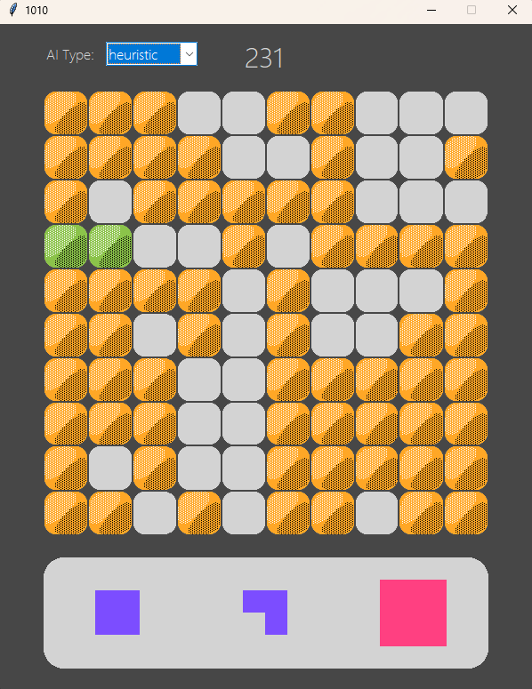

# 1010! Game AI



A Python implementation of the popular puzzle game 1010! with multiple AI strategies including Monte Carlo Tree Search (MCTS) and custom heuristics.

## About the Game

1010! is a Tetris-like puzzle game where the objective is to place various shapes on a 10x10 grid. Unlike Tetris, blocks don't fall from the top - you can place them anywhere they fit. When you form a complete row or column, it gets cleared from the board, earning you points. The game continues until no more blocks can be placed.

## Features

- **Interactive GUI**: Clean and intuitive interface built with Tkinter
- **Multiple AI Strategies**:
  - **MCTS (Monte Carlo Tree Search)**: Advanced algorithm that simulates possible future game states
  - **Heuristic**: Custom evaluation functions to determine optimal moves
  - **Greedy**: Simple strategy that maximizes immediate score
- **Real-time visualization**: See the AI's thought process as it places blocks
- **Line clearing animations**: Visual feedback when rows or columns are completed
- **Game over detection**: Automatically identifies when no further moves are possible

## Installation

1. Clone the repository:
   ```
   git clone https://github.com/punoqun/1010-.git
   cd 1010-
   ```

2. Install required dependencies:
   ```
   pip install numpy
   ```

3. Run the game:
   ```
   python main.py
   ```

## How to Play

1. Start the game by running `main.py`
2. Select an AI type from the dropdown menu
3. The AI will automatically place blocks on the board
4. Watch as the AI attempts to maximize score and game duration
5. When no more moves are possible, the game will display a "Game Over" screen with your score
6. Click "Play Again" to restart with the current AI strategy

## AI Strategies

### MCTS (Monte Carlo Tree Search)
- Combines tree search with random simulations
- Balances exploration and exploitation
- Evaluates potential moves by simulating many possible future game states
- Best overall performance, particularly in long-term planning

### Heuristic
- Uses custom evaluation functions to score potential moves
- Considers factors like board space utilization, potential for line clears, and avoiding isolated cells
- Good balance between performance and computational efficiency

### Greedy
- Selects moves that maximize immediate score gain
- Simple but effective strategy for basic gameplay
- Less computationally intensive than other strategies

## Implementation Details

The project is structured into several Python modules:
- `main.py`: Entry point for the application
- `gui.py`: Handles all visual elements and user interaction
- `game.py`: Core game logic and state management
- `ai.py`: Implementation of all AI strategies
- `blocks.py`: Block definitions and management
- `utils.py`: Utility functions for game operations
- `config.py`: Global configuration settings

## Requirements

- Python 3.7+
- NumPy

## License

This project is licensed under the MIT License - see the LICENSE file for details.

